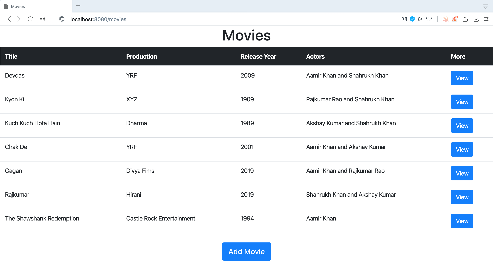
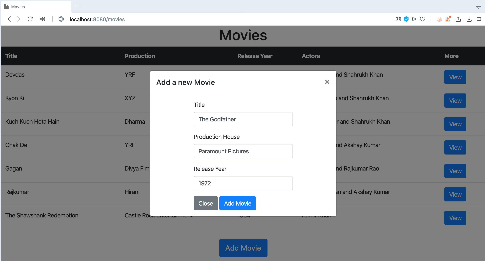
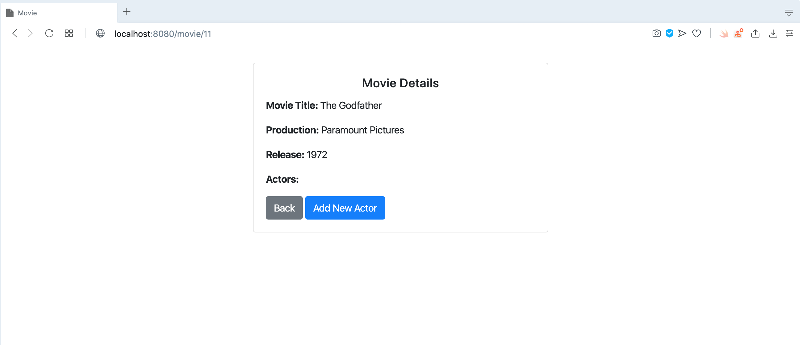
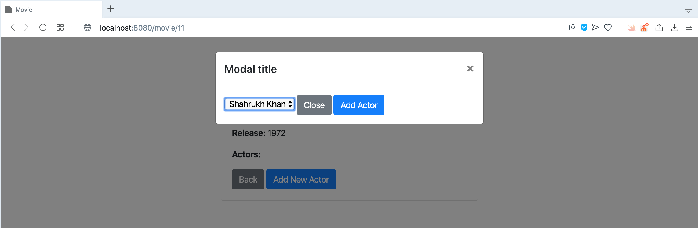
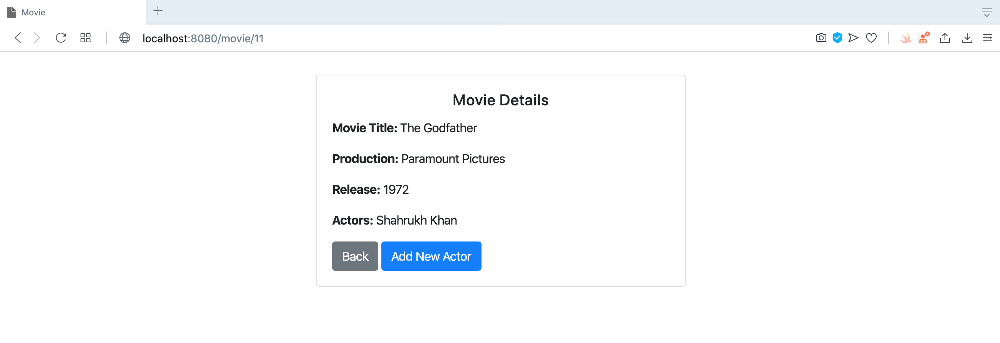

# Spring Boot Thymeleaf Movie App

## Things To Do list:

1. Install JDK 8 or JDK 21 on your machine
2. Install latest maven on your machine
3. Clone this repository: `https://github.com/hendisantika/spring-thymeleaf-movie-app.git`
4. Go to the folder: `cd spring-thymeleaf-movie-app`
5. Run the application: `mvn clean spring-boot:run`
6. Open your favorite browser: http://localhost:8080

## Images Screen shot

### List All the movies

### Add New Movie

### Add New Actor

### Add New Actor Pop Up

### View Movie Details

